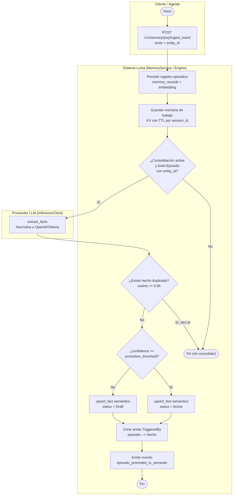

# Consolidación de memoria NS-Mem: de evento episódico a hecho semántico

_tipo: activity_ · _origen: e19e0f9f2d5b_

Proceso derivado de src/memory/ingest.rs (ingest_event: persist_memory_record, index_memory_record, persist_working_memory), src/memory/consolidator.rs (process: guardas kind=Episodic/entity_id/memory_consolidation_enabled, find_duplicate_fact con umbral 0.95, promoción Active/Draft según memory_fact_promotion_threshold, arista TriggeredBy, emit_consolidation_event) y src/memory/llm.rs (InferenceClient.extract_facts, providers None/Mock/OpenAI/Ollama). Tres actores reales: el Cliente/Agente que llama al endpoint REST /v1/memory/{namespace}/ingest_event, el Sistema Luma que orquesta la persistencia y consolidación, y el Proveedor LLM que extrae los FactCandidate.

<!-- tooling:diagram
{"has_content": true, "title": "Consolidación de memoria NS-Mem: de evento episódico a hecho semántico", "mermaid": "flowchart TD\n  subgraph C[\"Cliente / Agente\"]\n    ini([\"Inicio\"]) --> post[\"POST /v1/memory/{ns}/ingest_event texto + entity_id\"]\n  end\n  subgraph S[\"Sistema Luma (MemoryService / Engine)\"]\n    persist[\"Persistir registro episódico memory_records + embedding\"]\n    working[\"Guardar memoria de trabajo KV con TTL por session_id\"]\n    guard{\"¿Consolidación activa y kind=Episodic con entity_id?\"}\n    dedup{\"¿Existe hecho duplicado? cosine >= 0.95\"}\n    prom{\"¿confidence >= promotion_threshold?\"}\n    active[\"upsert_fact semántico status = Active\"]\n    draft[\"upsert_fact semántico status = Draft\"]\n    edge[\"Crear arista TriggeredBy episodio --> hecho\"]\n    emit[\"Emitir evento episodic_promoted_to_semantic\"]\n    finok([\"Fin\"])\n    finskip([\"Fin (sin consolidar)\"])\n  end\n  subgraph L[\"Proveedor LLM (InferenceClient)\"]\n    extract[\"extract_facts heurística u OpenAI/Ollama\"]\n  end\n  post --> persist\n  persist --> working\n  working --> guard\n  guard -->|No| finskip\n  guard -->|Sí| extract\n  extract --> dedup\n  dedup -->|Sí, otro id| finskip\n  dedup -->|No| prom\n  prom -->|Sí| active\n  prom -->|No| draft\n  active --> edge\n  draft --> edge\n  edge --> emit\n  emit --> finok", "notes": "Proceso derivado de src/memory/ingest.rs (ingest_event: persist_memory_record, index_memory_record, persist_working_memory), src/memory/consolidator.rs (process: guardas kind=Episodic/entity_id/memory_consolidation_enabled, find_duplicate_fact con umbral 0.95, promoción Active/Draft según memory_fact_promotion_threshold, arista TriggeredBy, emit_consolidation_event) y src/memory/llm.rs (InferenceClient.extract_facts, providers None/Mock/OpenAI/Ollama). Tres actores reales: el Cliente/Agente que llama al endpoint REST /v1/memory/{namespace}/ingest_event, el Sistema Luma que orquesta la persistencia y consolidación, y el Proveedor LLM que extrae los FactCandidate.", "kind": "activity", "source_sha": "e19e0f9f2d5beb133329fd21218bfdbdc37872bc"}
-->
