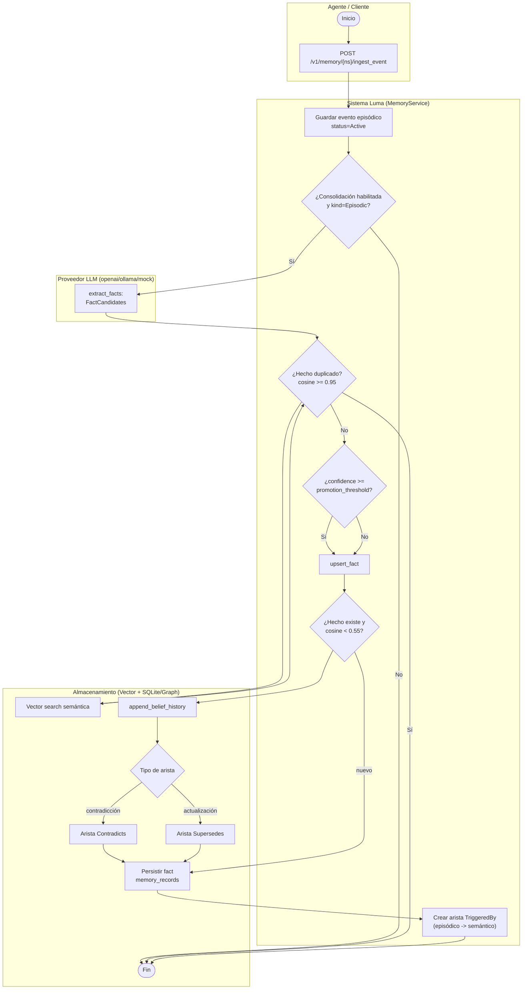

# Consolidación de memoria NS-Mem (ingesta → extracción → promoción de hechos)

_tipo: activity_ · _origen: e0cb9aa02235_

Actores y actividades derivados de src/memory/consolidator.rs (extracción vía LLM, dedup cosine>=0.95, promoción Active/Draft por memory_fact_promotion_threshold, arista TriggeredBy), src/memory/ingest.rs (ingest_event episódico Active; upsert_fact con belief versioning append_belief_history y aristas Contradicts si cosine<0.55 o Supersedes), src/memory/service.rs y src/memory/llm.rs (proveedores none/mock/openai/ollama), y src/api/routes_memory.rs (endpoints /v1/memory/{ns}/ingest_event, upsert_fact, query). Almacenamiento vector + SQLite/graph según CLAUDE.md.

<!-- tooling:diagram
{"has_content": true, "title": "Consolidación de memoria NS-Mem (ingesta → extracción → promoción de hechos)", "mermaid": "flowchart TD\n  subgraph AG[\"Agente / Cliente\"]\n    ini([\"Inicio\"]) --> post[\"POST /v1/memory/{ns}/ingest_event\"]\n  end\n  subgraph SYS[\"Sistema Luma (MemoryService)\"]\n    epi[\"Guardar evento episódico status=Active\"]\n    consol{\"¿Consolidación habilitada y kind=Episodic?\"}\n    dedup{\"¿Hecho duplicado? cosine >= 0.95\"}\n    prom{\"¿confidence >= promotion_threshold?\"}\n    upf[\"upsert_fact\"]\n    contra{\"¿Hecho existe y cosine < 0.55?\"}\n    edge[\"Crear arista TriggeredBy (episódico -> semántico)\"]\n  end\n  subgraph LLM[\"Proveedor LLM (openai/ollama/mock)\"]\n    ext[\"extract_facts: FactCandidates\"]\n  end\n  subgraph STO[\"Almacenamiento (Vector + SQLite/Graph)\"]\n    knn[\"Vector search semántica\"]\n    hist[\"append_belief_history\"]\n    ce{\"Tipo de arista\"}\n    sup[\"Arista Supersedes\"]\n    con[\"Arista Contradicts\"]\n    save[\"Persistir fact memory_records\"]\n    fin([\"Fin\"])\n  end\n  post --> epi\n  epi --> consol\n  consol -->|No| fin\n  consol -->|Sí| ext\n  ext --> dedup\n  dedup --> knn\n  knn --> dedup\n  dedup -->|Sí| fin\n  dedup -->|No| prom\n  prom -->|Sí| upf\n  prom -->|No| upf\n  upf --> contra\n  contra --> hist\n  hist --> ce\n  ce -->|contradicción| con\n  ce -->|actualización| sup\n  con --> save\n  sup --> save\n  contra -->|nuevo| save\n  save --> edge\n  edge --> fin", "notes": "Actores y actividades derivados de src/memory/consolidator.rs (extracción vía LLM, dedup cosine>=0.95, promoción Active/Draft por memory_fact_promotion_threshold, arista TriggeredBy), src/memory/ingest.rs (ingest_event episódico Active; upsert_fact con belief versioning append_belief_history y aristas Contradicts si cosine<0.55 o Supersedes), src/memory/service.rs y src/memory/llm.rs (proveedores none/mock/openai/ollama), y src/api/routes_memory.rs (endpoints /v1/memory/{ns}/ingest_event, upsert_fact, query). Almacenamiento vector + SQLite/graph según CLAUDE.md.", "kind": "activity", "source_sha": "e0cb9aa02235c9bd3ece7d850d54f54655178cf1"}
-->
