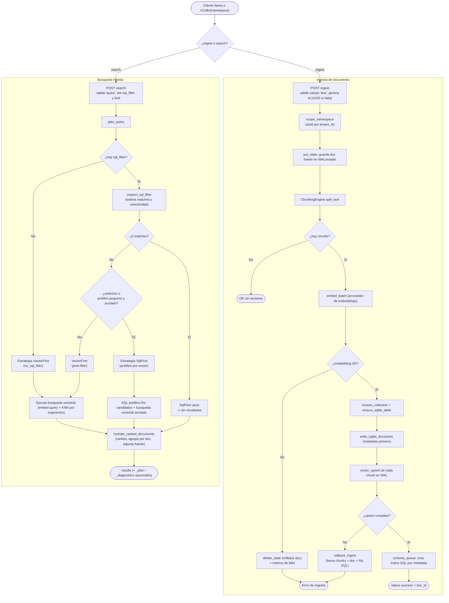

# Flujo principal de Luma — ingesta híbrida y búsqueda con planner (LumaDatabase / /v1/db)

_tipo: flowchart_ · _origen: 93c77116d9aa_

Flujo derivado del código real: src/api/routes_hub.rs (handlers ingest/search, scope_namespace por tenant) y src/engine/hub.rs (LumaDatabase::ingest_document con chunking → embed_batch → put_state/SQLite/vector_upsert y rollback ante fallo; search_with_plan → plan_query que elige SqlFirst/VectorFirst según selectividad e inspect_sql_filter → execute_* → hydrate_ranked_documents). Es el flujo de negocio Nivel 2 (/v1/db), el más representativo que orquesta chunking, embeddings, SQLite y el store vectorial. Existen otros flujos (NS-Mem /v1/memory, primitivas /v1/vector) no dibujados por brevedad.

 op{\"¿ingest o search?\"}\n\n  subgraph \"Ingesta de documento\"\n    ing1[\"POST ingest valida campo 'text', genera id (UUID si falta)\"] --> ing2[\"scope_namespace (aisla por tenant_id)\"]\n    ing2 --> ing3[\"put_state: guarda doc fuente en WAL/estado\"]\n    ing3 --> ing4[\"ChunkingEngine.split_text\"]\n    ing4 --> chk{\"¿hay chunks?\"}\n    chk -->|No| fin1([\"OK sin vectores\"])\n    chk -->|Sí| ing5[\"embed_batch (proveedor de embeddings)\"]\n    ing5 --> emb{\"¿embedding OK?\"}\n    emb -->|No| rb1[\"delete_state (rollback doc) + metrica de fallo\"] --> errI([\"Error de ingesta\"])\n    emb -->|Sí| ing6[\"ensure_collection + ensure_sqlite_table\"]\n    ing6 --> ing7[\"write_sqlite_document (metadata primero)\"]\n    ing7 --> ing8[\"vector_upsert de cada chunk en WAL\"]\n    ing8 --> ups{\"¿upsert completo?\"}\n    ups -->|No| rb2[\"rollback_ingest (borra chunks + doc + fila SQL)\"] --> errI\n    ups -->|Sí| ing9[\"schema_queue: crea indice SQL por metadata\"]\n    ing9 --> finI([\"status success + doc_id\"])\n  end\n\n  subgraph \"Busqueda hibrida\"\n    se1[\"POST search valida 'query', lee sql_filter y limit\"] --> se2[\"plan_query\"]\n    se2 --> pf{\"¿hay sql_filter?\"}\n    pf -->|No| stV[\"Estrategia VectorFirst (no_sql_filter)\"]\n    pf -->|Sí| ins[\"inspect_sql_filter (estima matches y selectividad)\"]\n    ins --> zero{\"¿0 matches?\"}\n    zero -->|Sí| empty[\"SqlFirst vacio -> sin resultados\"]\n    zero -->|No| sel{\"¿selectivo o prefiltro pequeno y acotado?\"}\n    sel -->|Sí| stS[\"Estrategia SqlFirst (prefiltro pre-vector)\"]\n    sel -->|No| stV2[\"VectorFirst (post-filter)\"]\n    stV --> exec[\"Ejecuta busqueda vectorial (embed query + KNN por segmentos)\"]\n    stV2 --> exec\n    stS --> execS[\"SQL prefiltra IDs candidatos + busqueda vectorial acotada\"]\n    exec --> hyd[\"hydrate_ranked_documents (rankea, agrupa por doc, adjunta fuente)\"]\n    execS --> hyd\n    empty --> hyd\n    hyd --> finS([\"results (+ _plan / _diagnostics opcionales)\"])\n  end\n\n  op -->|ingest| ing1\n  op -->|search| se1", "notes": "Flujo derivado del código real: src/api/routes_hub.rs (handlers ingest/search, scope_namespace por tenant) y src/engine/hub.rs (LumaDatabase::ingest_document con chunking → embed_batch → put_state/SQLite/vector_upsert y rollback ante fallo; search_with_plan → plan_query que elige SqlFirst/VectorFirst según selectividad e inspect_sql_filter → execute_* → hydrate_ranked_documents). Es el flujo de negocio Nivel 2 (/v1/db), el más representativo que orquesta chunking, embeddings, SQLite y el store vectorial. Existen otros flujos (NS-Mem /v1/memory, primitivas /v1/vector) no dibujados por brevedad.", "kind": "flowchart", "source_sha": "93c77116d9aaf23df115815b874e03465214e421"}
-->
