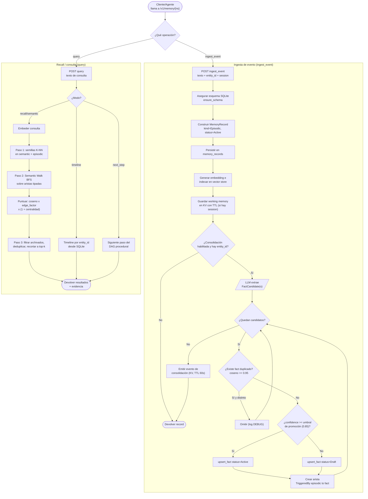

# Flujo NS-Mem: ingesta de evento, consolidación y recall (memoria de agente)

_tipo: flowchart_ · _origen: c3da68372c88_

Flujo derivado del código real de NS-Mem (Level 3): src/memory/ingest.rs (ingest_event → persist_memory_record → index_memory_record → persist_working_memory → consolidator.process), src/memory/consolidator.rs (extracción de facts por LLM, dedup coseno>=0.95, promoción según memory_fact_promotion_threshold=0.85, arista TriggeredBy), src/memory/retrieval.rs (query → recall: K-NN seeds → semantic_walk BFS → filtrado top-k; modos timeline y next_step), rutas en src/api/routes_memory.rs. Se eligió el flujo NS-Mem por ser la capa de negocio insignia (memoria de agente) del motor; existen otros flujos (hub de documentos en engine/hub.rs, auth/multi-tenancy) no dibujados por claridad.

<!-- vulcano:diagram
{"has_content": true, "title": "Flujo NS-Mem: ingesta de evento, consolidación y recall (memoria de agente)", "mermaid": "flowchart TD\n  ini([\"Cliente/Agente llama a /v1/memory/{ns}\"]) --> ruta{\"¿Qué operación?\"}\n\n  subgraph \"Ingesta de evento (ingest_event)\"\n    ing[\"POST ingest_event texto + entity_id + session\"] --> schema[\"Asegurar esquema SQLite ensure_schema\"]\n    schema --> rec[\"Construir MemoryRecord kind=Episodic, status=Active\"]\n    rec --> persist[\"Persistir en memory_records\"]\n    persist --> idx[\"Generar embedding e indexar en vector store\"]\n    idx --> work[\"Guardar working memory en KV con TTL (si hay session)\"]\n    work --> consEn{\"¿Consolidación habilitada y hay entity_id?\"}\n    consEn -->|No| finIng([\"Devolver record\"])\n    consEn -->|Sí| llm[/\"LLM extrae FactCandidate(s)\"/]\n    llm --> loop{\"¿Quedan candidatos?\"}\n    loop -->|No| emit[\"Emitir evento de consolidación (KV, TTL 60s)\"]\n    emit --> finIng\n    loop -->|Sí| dup{\"¿Existe fact duplicado? coseno >= 0.95\"}\n    dup -->|Sí y distinto| skip[\"Omitir (log DEBUG)\"]\n    skip --> loop\n    dup -->|No| prom{\"¿confidence >= umbral de promoción (0.85)?\"}\n    prom -->|Sí| act[\"upsert_fact status=Active\"]\n    prom -->|No| draft[\"upsert_fact status=Draft\"]\n    act --> edge[\"Crear arista TriggeredBy episodic to fact\"]\n    draft --> edge\n    edge --> loop\n  end\n\n  subgraph \"Recall / consulta (query)\"\n    q[\"POST query texto de consulta\"] --> qmode{\"¿Modo?\"}\n    qmode -->|timeline| tl[\"Timeline por entity_id desde SQLite\"]\n    qmode -->|next_step| ns[\"Siguiente paso del DAG procedural\"]\n    qmode -->|recall/semantic| emb[\"Embeder consulta\"]\n    emb --> knn[\"Paso 1: semillas K-NN en semantic + episodic\"]\n    knn --> walk[\"Paso 2: Semantic Walk BFS sobre aristas tipadas\"]\n    walk --> score[\"Puntuar: coseno x edge_factor x (1 + centralidad)\"]\n    score --> filt[\"Paso 3: filtrar archivados, deduplicar, recortar a top-k\"]\n    filt --> resp([\"Devolver resultados + evidencia\"])\n    tl --> resp\n    ns --> resp\n  end\n\n  ruta -->|ingest_event| ing\n  ruta -->|query| q", "notes": "Flujo derivado del código real de NS-Mem (Level 3): src/memory/ingest.rs (ingest_event → persist_memory_record → index_memory_record → persist_working_memory → consolidator.process), src/memory/consolidator.rs (extracción de facts por LLM, dedup coseno>=0.95, promoción según memory_fact_promotion_threshold=0.85, arista TriggeredBy), src/memory/retrieval.rs (query → recall: K-NN seeds → semantic_walk BFS → filtrado top-k; modos timeline y next_step), rutas en src/api/routes_memory.rs. Se eligió el flujo NS-Mem por ser la capa de negocio insignia (memoria de agente) del motor; existen otros flujos (hub de documentos en engine/hub.rs, auth/multi-tenancy) no dibujados por claridad.", "kind": "flowchart", "source_sha": "c3da68372c8886687ad430b7865905e7fc27e315"}
-->
