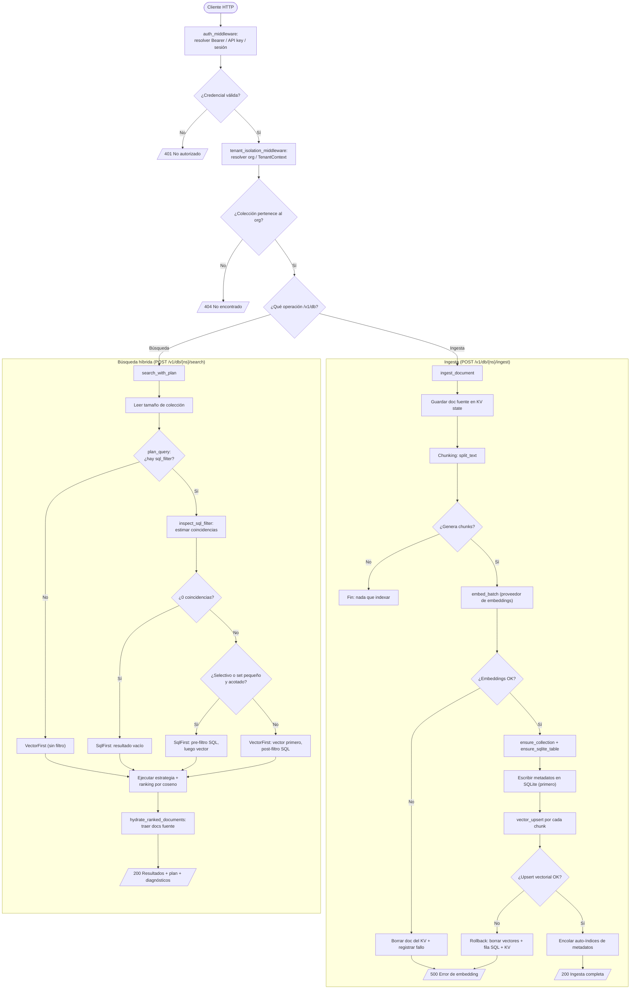

# Flujo principal de Luma: ingesta híbrida y búsqueda con planificador

_tipo: flowchart_ · _origen: 4c382dee762e_

Flujo derivado de src/api/auth.rs (auth_middleware) y src/api/mod.rs (tenant_isolation_middleware), con el núcleo de negocio en src/engine/hub.rs: LumaDatabase::ingest_document (chunking -> embed_batch -> escritura SQLite-primero -> vector_upsert con rollback) y search_with_plan/plan_query (planificador que elige SqlFirst vs VectorFirst según selectividad del filtro SQL, luego hidratación de documentos). Rutas en src/api/routes_hub.rs (/v1/db). Se eligió el nivel 2 (LumaDatabase) por ser el flujo de negocio más representativo; se omiten los flujos primitivos (nivel 1) y NS-Mem (nivel 3) por claridad.

<!-- tooling:diagram
{"has_content": true, "title": "Flujo principal de Luma: ingesta híbrida y búsqueda con planificador", "mermaid": "flowchart TD\n  ini([\"Cliente HTTP\"]) --> auth[\"auth_middleware: resolver Bearer / API key / sesión\"]\n  auth --> authok{\"¿Credencial válida?\"}\n  authok -->|No| e401[/\"401 No autorizado\"/]\n  authok -->|Sí| tenant[\"tenant_isolation_middleware: resolver org / TenantContext\"]\n  tenant --> tok{\"¿Colección pertenece al org?\"}\n  tok -->|No| e404[/\"404 No encontrado\"/]\n  tok -->|Sí| ruta{\"¿Qué operación /v1/db?\"}\n\n  subgraph \"Ingesta (POST /v1/db/{ns}/ingest)\"\n    ing[\"ingest_document\"] --> store[\"Guardar doc fuente en KV state\"]\n    store --> chunk[\"Chunking: split_text\"]\n    chunk --> vac{\"¿Genera chunks?\"}\n    vac -->|No| okvacio[\"Fin: nada que indexar\"]\n    vac -->|Sí| embed[\"embed_batch (proveedor de embeddings)\"]\n    embed --> eok{\"¿Embeddings OK?\"}\n    eok -->|No| rbdoc[\"Borrar doc del KV + registrar fallo\"]\n    rbdoc --> eerr[/\"500 Error de embedding\"/]\n    eok -->|Sí| ensure[\"ensure_collection + ensure_sqlite_table\"]\n    ensure --> sqlw[\"Escribir metadatos en SQLite (primero)\"]\n    sqlw --> vecw[\"vector_upsert por cada chunk\"]\n    vecw --> vok{\"¿Upsert vectorial OK?\"}\n    vok -->|No| rback[\"Rollback: borrar vectores + fila SQL + KV\"]\n    rback --> eerr\n    vok -->|Sí| idx[\"Encolar auto-índices de metadatos\"]\n    idx --> okok[/\"200 Ingesta completa\"/]\n  end\n\n  subgraph \"Búsqueda híbrida (POST /v1/db/{ns}/search)\"\n    srch[\"search_with_plan\"] --> csize[\"Leer tamaño de colección\"]\n    csize --> plan{\"plan_query: ¿hay sql_filter?\"}\n    plan -->|No| vf1[\"VectorFirst (sin filtro)\"]\n    plan -->|Sí| insp[\"inspect_sql_filter: estimar coincidencias\"]\n    insp --> empty{\"¿0 coincidencias?\"}\n    empty -->|Sí| sfempty[\"SqlFirst: resultado vacío\"]\n    empty -->|No| selec{\"¿Selectivo o set pequeño y acotado?\"}\n    selec -->|Sí| sf[\"SqlFirst: pre-filtro SQL, luego vector\"]\n    selec -->|No| vf2[\"VectorFirst: vector primero, post-filtro SQL\"]\n    vf1 --> exec[\"Ejecutar estrategia + ranking por coseno\"]\n    sfempty --> exec\n    sf --> exec\n    vf2 --> exec\n    exec --> hydr[\"hydrate_ranked_documents: traer docs fuente\"]\n    hydr --> res[/\"200 Resultados + plan + diagnósticos\"/]\n  end\n\n  ruta -->|Ingesta| ing\n  ruta -->|Búsqueda| srch", "notes": "Flujo derivado de src/api/auth.rs (auth_middleware) y src/api/mod.rs (tenant_isolation_middleware), con el núcleo de negocio en src/engine/hub.rs: LumaDatabase::ingest_document (chunking -> embed_batch -> escritura SQLite-primero -> vector_upsert con rollback) y search_with_plan/plan_query (planificador que elige SqlFirst vs VectorFirst según selectividad del filtro SQL, luego hidratación de documentos). Rutas en src/api/routes_hub.rs (/v1/db). Se eligió el nivel 2 (LumaDatabase) por ser el flujo de negocio más representativo; se omiten los flujos primitivos (nivel 1) y NS-Mem (nivel 3) por claridad.", "kind": "flowchart", "source_sha": "4c382dee762e8e6e772a6162c327abb7cc4fbf23"}
-->
