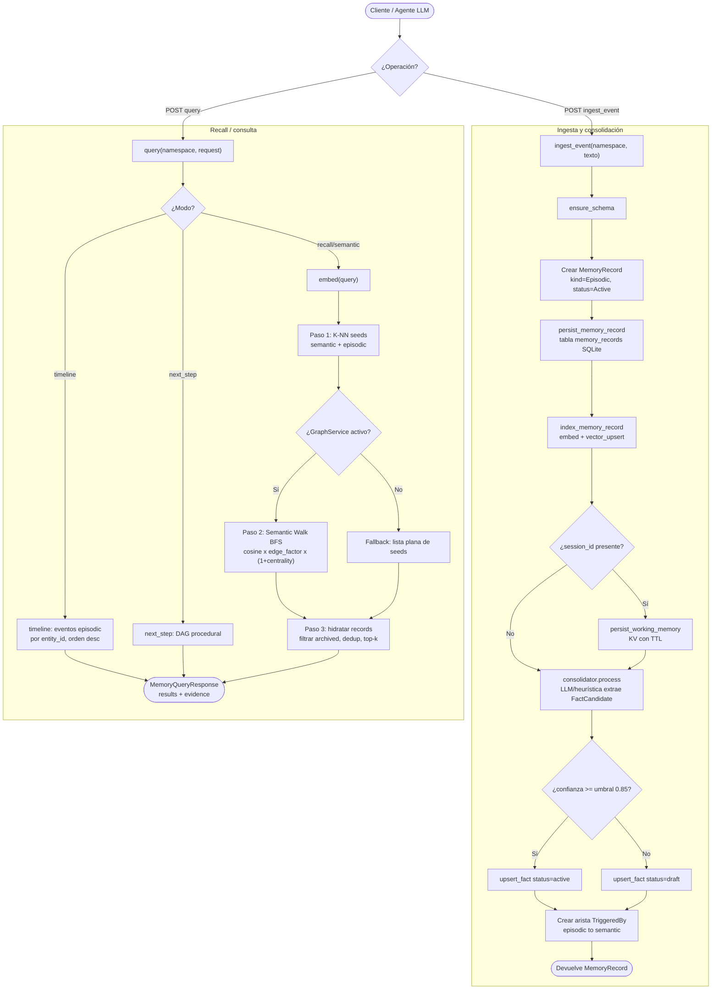

# Flujo NS-Mem: ingesta de evento y recall (memoria de agente)

_tipo: flowchart_ · _origen: d0337b8c798f_

Flujo derivado del código real de la capa Level 3 (NS-Mem). Ingesta: src/memory/ingest.rs (ingest_event, upsert_fact, index_memory_record, persist_working_memory) + consolidación descrita en consolidator.process. Recall: src/memory/retrieval.rs (query resuelve modo timeline/next_step/recall; recall hace K-NN seeds, semantic walk BFS sobre memory_edges y filtrado). Umbral de promoción 0.85 y factores de arista tomados de CLAUDE.md/config. Es el flujo de negocio más representativo del motor de memoria para agentes; existe además el flujo hibrido de LumaDatabase (src/engine/hub.rs: ingest_document y search_with_plan con planner SQL-first/vector-first) no diagramado aqui por brevedad.

<!-- tooling:diagram
{"has_content": true, "title": "Flujo NS-Mem: ingesta de evento y recall (memoria de agente)", "mermaid": "flowchart TD\n  ini([\"Cliente / Agente LLM\"]) --> op{\"¿Operación?\"}\n  op -->|POST ingest_event| ing[\"ingest_event(namespace, texto)\"]\n  op -->|POST query| qry[\"query(namespace, request)\"]\n\n  subgraph \"Ingesta y consolidación\"\n    ing --> schema[\"ensure_schema\"]\n    schema --> rec[\"Crear MemoryRecord kind=Episodic, status=Active\"]\n    rec --> persist[\"persist_memory_record tabla memory_records SQLite\"]\n    persist --> index[\"index_memory_record embed + vector_upsert\"]\n    index --> work{\"¿session_id presente?\"}\n    work -->|Sí| kv[\"persist_working_memory KV con TTL\"]\n    work -->|No| cons\n    kv --> cons[\"consolidator.process LLM/heurística extrae FactCandidate\"]\n    cons --> conf{\"¿confianza >= umbral 0.85?\"}\n    conf -->|Sí| factA[\"upsert_fact status=active\"]\n    conf -->|No| factD[\"upsert_fact status=draft\"]\n    factA --> edge[\"Crear arista TriggeredBy episodic to semantic\"]\n    factD --> edge\n    edge --> okIng([\"Devuelve MemoryRecord\"])\n  end\n\n  subgraph \"Recall / consulta\"\n    qry --> mode{\"¿Modo?\"}\n    mode -->|timeline| tl[\"timeline: eventos episodic por entity_id, orden desc\"]\n    mode -->|next_step| ns[\"next_step: DAG procedural\"]\n    mode -->|recall/semantic| emb[\"embed(query)\"]\n    tl --> resp\n    ns --> resp\n    emb --> knn[\"Paso 1: K-NN seeds semantic + episodic\"]\n    knn --> hasG{\"¿GraphService activo?\"}\n    hasG -->|Sí| walk[\"Paso 2: Semantic Walk BFS cosine x edge_factor x (1+centrality)\"]\n    hasG -->|No| flat[\"Fallback: lista plana de seeds\"]\n    walk --> filt[\"Paso 3: hidratar records filtrar archived, dedup, top-k\"]\n    flat --> filt\n    filt --> resp([\"MemoryQueryResponse results + evidence\"])\n  end", "notes": "Flujo derivado del código real de la capa Level 3 (NS-Mem). Ingesta: src/memory/ingest.rs (ingest_event, upsert_fact, index_memory_record, persist_working_memory) + consolidación descrita en consolidator.process. Recall: src/memory/retrieval.rs (query resuelve modo timeline/next_step/recall; recall hace K-NN seeds, semantic walk BFS sobre memory_edges y filtrado). Umbral de promoción 0.85 y factores de arista tomados de CLAUDE.md/config. Es el flujo de negocio más representativo del motor de memoria para agentes; existe además el flujo hibrido de LumaDatabase (src/engine/hub.rs: ingest_document y search_with_plan con planner SQL-first/vector-first) no diagramado aqui por brevedad.", "kind": "flowchart", "source_sha": "d0337b8c798ffb071131a3f80e956f39c79a9cfa"}
-->
