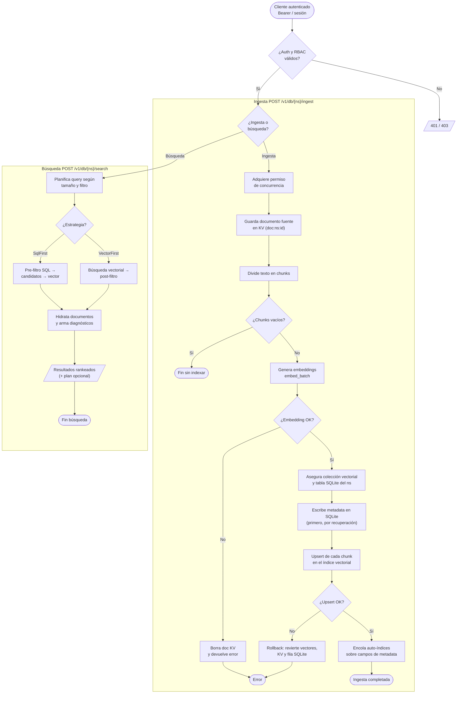

# Flujo Luma: ingesta híbrida de documentos y búsqueda (Level 2 /v1/db)

_tipo: flowchart_ · _origen: 466e4fe606cf_

Flujo derivado del código real: src/api/mod.rs (auth_middleware + RBAC), src/api/routes_hub.rs (ingest/search), y src/engine/hub.rs (ingest_document líneas 149-274: KV → chunking → embeddings → SQLite → upsert vectorial con rollback; search_with_plan líneas 289-324: planner → SqlFirst/VectorFirst → hidratación). Se eligió el hub Level 2 (/v1/db) por ser la lógica de negocio más representativa que orquesta todos los subsistemas. Existen otros flujos (NS-Mem en src/memory/, vector primitivo, auth enterprise) no dibujados para priorizar claridad.

<!-- tooling:diagram
{"has_content": true, "title": "Flujo Luma: ingesta híbrida de documentos y búsqueda (Level 2 /v1/db)", "mermaid": "flowchart TD\n  ini([\"Cliente autenticado Bearer / sesión\"]) --> auth{\"¿Auth y RBAC válidos?\"}\n  auth -->|No| deny[/\"401 / 403\"/]\n  auth -->|Sí| accion{\"¿Ingesta o búsqueda?\"}\n\n  subgraph \"Ingesta POST /v1/db/{ns}/ingest\"\n    accion -->|Ingesta| permit[\"Adquiere permiso de concurrencia\"]\n    permit --> store[\"Guarda documento fuente en KV (doc:ns:id)\"]\n    store --> chunk[\"Divide texto en chunks\"]\n    chunk --> vacio{\"¿Chunks vacíos?\"}\n    vacio -->|Sí| finish([\"Fin sin indexar\"])\n    vacio -->|No| embed[\"Genera embeddings embed_batch\"]\n    embed --> emberr{\"¿Embedding OK?\"}\n    emberr -->|No| rberr[\"Borra doc KV y devuelve error\"]\n    rberr --> err([\"Error\"])\n    emberr -->|Sí| ensure[\"Asegura colección vectorial y tabla SQLite del ns\"]\n    ensure --> sqlw[\"Escribe metadata en SQLite (primero, por recuperación)\"]\n    sqlw --> vecw[\"Upsert de cada chunk en el índice vectorial\"]\n    vecw --> vecok{\"¿Upsert OK?\"}\n    vecok -->|No| rollback[\"Rollback: revierte vectores,\\nKV y fila SQLite\"]\n    rollback --> err\n    vecok -->|Sí| idx[\"Encola auto-índices sobre campos de metadata\"]\n    idx --> done([\"Ingesta completada\"])\n  end\n\n  subgraph \"Búsqueda POST /v1/db/{ns}/search\"\n    accion -->|Búsqueda| plan[\"Planifica query según tamaño y filtro\"]\n    plan --> strat{\"¿Estrategia?\"}\n    strat -->|SqlFirst| sqlf[\"Pre-filtro SQL → candidatos → vector\"]\n    strat -->|VectorFirst| vecf[\"Búsqueda vectorial → post-filtro\"]\n    sqlf --> hyd[\"Hidrata documentos y arma diagnósticos\"]\n    vecf --> hyd\n    hyd --> res[/\"Resultados rankeados (+ plan opcional)\"/]\n    res --> endsearch([\"Fin búsqueda\"])\n  end", "notes": "Flujo derivado del código real: src/api/mod.rs (auth_middleware + RBAC), src/api/routes_hub.rs (ingest/search), y src/engine/hub.rs (ingest_document líneas 149-274: KV → chunking → embeddings → SQLite → upsert vectorial con rollback; search_with_plan líneas 289-324: planner → SqlFirst/VectorFirst → hidratación). Se eligió el hub Level 2 (/v1/db) por ser la lógica de negocio más representativa que orquesta todos los subsistemas. Existen otros flujos (NS-Mem en src/memory/, vector primitivo, auth enterprise) no dibujados para priorizar claridad.", "kind": "flowchart", "source_sha": "466e4fe606cfa6a74e9e4fda1876d33321971620"}
-->
