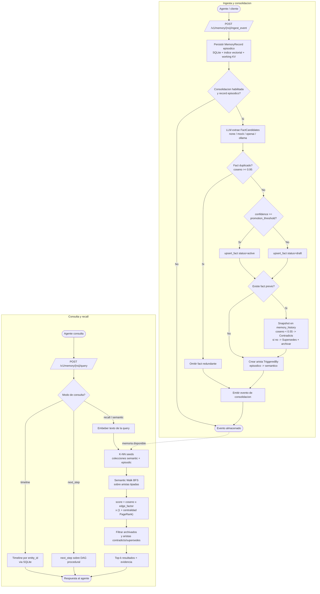

# Flujo NS-Mem: ingesta/consolidación de memoria y recall del agente

_tipo: flowchart_ · _origen: a10e23646f01_

Flujo derivado del Level 3 NS-Mem (la logica de negocio distintiva de Luma): src/api/routes_memory.rs, src/memory/ingest.rs (ingest_event, upsert_fact con versionado de creencias y deteccion de contradicciones por coseno < 0.55), src/memory/consolidator.rs (extraccion LLM de FactCandidates, dedup coseno >= 0.95, promocion active/draft por umbral, arista TriggeredBy), y src/memory/retrieval.rs (query: modos timeline/next_step/recall; recall = K-NN seeds -> Semantic Walk BFS -> scoring coseno x edge_factor x (1+centralidad) -> filtro de archivados -> top-k). Los primitivos de vector/state/SQL (Level 1/2) sostienen este flujo pero no son la logica de negocio principal.

<!-- tooling:diagram
{"has_content": true, "title": "Flujo NS-Mem: ingesta/consolidación de memoria y recall del agente", "mermaid": "flowchart TD\n  subgraph ING[\"Ingesta y consolidacion\"]\n    ini([\"Agente / cliente\"]) --> ingest[/\"POST /v1/memory/{ns}/ingest_event\"/]\n    ingest --> persist[\"Persistir MemoryRecord episodico SQLite + indice vectorial + working KV\"]\n    persist --> consEn{\"Consolidacion habilitada y record episodico?\"}\n    consEn -->|No| doneIng([\"Evento almacenado\"])\n    consEn -->|Si| extract[\"LLM extrae FactCandidates none / mock / openai / ollama\"]\n    extract --> dup{\"Fact duplicado? coseno >= 0.95\"}\n    dup -->|Si| skip[\"Omitir fact redundante\"]\n    dup -->|No| conf{\"confidence >= promotion_threshold?\"}\n    conf -->|Si| active[\"upsert_fact status=active\"]\n    conf -->|No| draft[\"upsert_fact status=draft\"]\n    active --> vers{\"Existe fact previo?\"}\n    draft --> vers\n    vers -->|Si| hist[\"Snapshot en memory_history coseno < 0.55 -> Contradicts si no -> Supersedes + archivar\"]\n    vers -->|No| edge\n    hist --> edge[\"Crear arista TriggeredBy episodico -> semantico\"]\n    skip --> emit\n    edge --> emit[\"Emitir evento de consolidacion\"]\n    emit --> doneIng\n  end\n  subgraph QRY[\"Consulta y recall\"]\n    q([\"Agente consulta\"]) --> query[/\"POST /v1/memory/{ns}/query\"/]\n    query --> mode{\"Modo de consulta?\"}\n    mode -->|timeline| tl[\"Timeline por entity_id via SQLite\"]\n    mode -->|next_step| step[\"next_step sobre DAG procedural\"]\n    mode -->|recall / semantic| emb[\"Embeber texto de la query\"]\n    emb --> knn[\"K-NN seeds colecciones semantic + episodic\"]\n    knn --> walk[\"Semantic Walk BFS sobre aristas tipadas\"]\n    walk --> score[\"score = coseno x edge_factor x (1 + centralidad PageRank)\"]\n    score --> filt[\"Filtrar archivados y aristas contradicts/supersedes\"]\n    filt --> topk[\"Top-k resultados + evidencia\"]\n    tl --> resp([\"Respuesta al agente\"])\n    step --> resp\n    topk --> resp\n  end\n  doneIng -.->|memoria disponible| knn", "notes": "Flujo derivado del Level 3 NS-Mem (la logica de negocio distintiva de Luma): src/api/routes_memory.rs, src/memory/ingest.rs (ingest_event, upsert_fact con versionado de creencias y deteccion de contradicciones por coseno < 0.55), src/memory/consolidator.rs (extraccion LLM de FactCandidates, dedup coseno >= 0.95, promocion active/draft por umbral, arista TriggeredBy), y src/memory/retrieval.rs (query: modos timeline/next_step/recall; recall = K-NN seeds -> Semantic Walk BFS -> scoring coseno x edge_factor x (1+centralidad) -> filtro de archivados -> top-k). Los primitivos de vector/state/SQL (Level 1/2) sostienen este flujo pero no son la logica de negocio principal.", "kind": "flowchart", "source_sha": "a10e23646f0118b2e87d448044516da8eb21f1dd"}
-->
