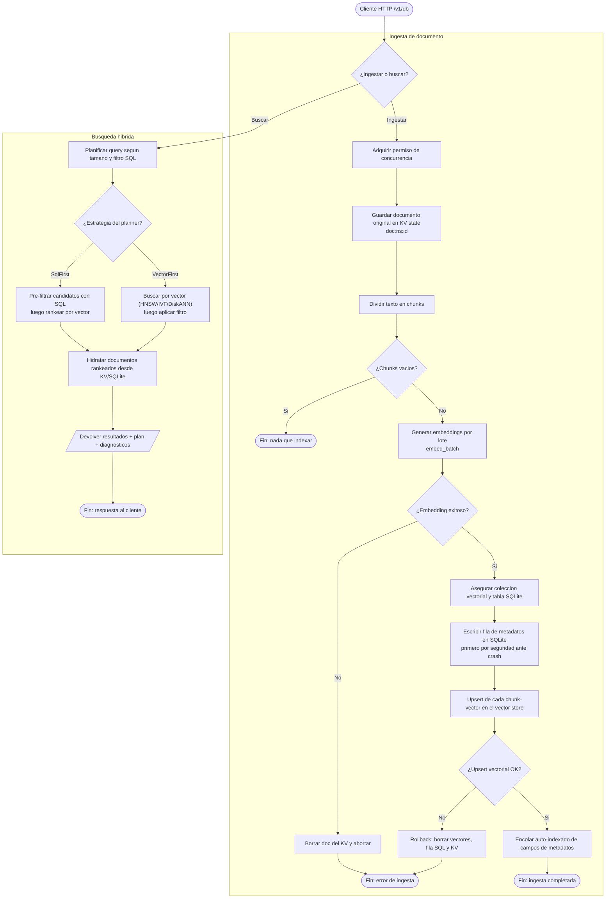

# Flujo híbrido de LumaDatabase: ingesta y búsqueda de documentos

_tipo: flowchart_ · _origen: cf506069f3c1_

Flujo derivado de src/engine/hub.rs: LumaDatabase (Level 2). Ingesta = ingest_document() (KV store -> chunking -> embed_batch -> ensure collection/tabla -> escritura SQLite primero -> upsert vectorial con rollback -> auto-indexado de metadatos). Busqueda = search_with_plan() con plan_query() eligiendo QueryStrategy::SqlFirst o VectorFirst, seguido de hydrate_ranked_documents(). Se omiten Level 1 (primitivas) y Level 3 (NS-Mem) por claridad; el hub es el orquestador mas representativo del negocio.

<!-- vulcano:diagram
{"has_content": true, "title": "Flujo híbrido de LumaDatabase: ingesta y búsqueda de documentos", "mermaid": "flowchart TD\n  ini([\"Cliente HTTP /v1/db\"]) --> op{\"¿Ingestar o buscar?\"}\n\n  subgraph \"Ingesta de documento\"\n    op -->|Ingestar| perm[\"Adquirir permiso de concurrencia\"]\n    perm --> store[\"Guardar documento original en KV state doc:ns:id\"]\n    store --> chunk[\"Dividir texto en chunks\"]\n    chunk --> emptychk{\"¿Chunks vacios?\"}\n    emptychk -->|Si| finok([\"Fin: nada que indexar\"])\n    emptychk -->|No| embed[\"Generar embeddings por lote embed_batch\"]\n    embed --> embok{\"¿Embedding exitoso?\"}\n    embok -->|No| delkv[\"Borrar doc del KV y abortar\"]\n    delkv --> ferr([\"Fin: error de ingesta\"])\n    embok -->|Si| ensure[\"Asegurar coleccion vectorial y tabla SQLite\"]\n    ensure --> sqlw[\"Escribir fila de metadatos en SQLite primero por seguridad ante crash\"]\n    sqlw --> vecw[\"Upsert de cada chunk-vector en el vector store\"]\n    vecw --> vecok{\"¿Upsert vectorial OK?\"}\n    vecok -->|No| rollback[\"Rollback: borrar vectores, fila SQL y KV\"]\n    rollback --> ferr\n    vecok -->|Si| idx[\"Encolar auto-indexado de campos de metadatos\"]\n    idx --> done([\"Fin: ingesta completada\"])\n  end\n\n  subgraph \"Busqueda hibrida\"\n    op -->|Buscar| plan[\"Planificar query segun tamano y filtro SQL\"]\n    plan --> strat{\"¿Estrategia del planner?\"}\n    strat -->|SqlFirst| sqlf[\"Pre-filtrar candidatos con SQL luego rankear por vector\"]\n    strat -->|VectorFirst| vecf[\"Buscar por vector (HNSW/IVF/DiskANN) luego aplicar filtro\"]\n    sqlf --> hyd[\"Hidratar documentos rankeados desde KV/SQLite\"]\n    vecf --> hyd\n    hyd --> resp[/\"Devolver resultados + plan + diagnosticos\"/]\n    resp --> finq([\"Fin: respuesta al cliente\"])\n  end", "notes": "Flujo derivado de src/engine/hub.rs: LumaDatabase (Level 2). Ingesta = ingest_document() (KV store -> chunking -> embed_batch -> ensure collection/tabla -> escritura SQLite primero -> upsert vectorial con rollback -> auto-indexado de metadatos). Busqueda = search_with_plan() con plan_query() eligiendo QueryStrategy::SqlFirst o VectorFirst, seguido de hydrate_ranked_documents(). Se omiten Level 1 (primitivas) y Level 3 (NS-Mem) por claridad; el hub es el orquestador mas representativo del negocio.", "kind": "flowchart", "source_sha": "cf506069f3c1b0a2f8860fa79b09d3b9d4359ccc"}
-->
