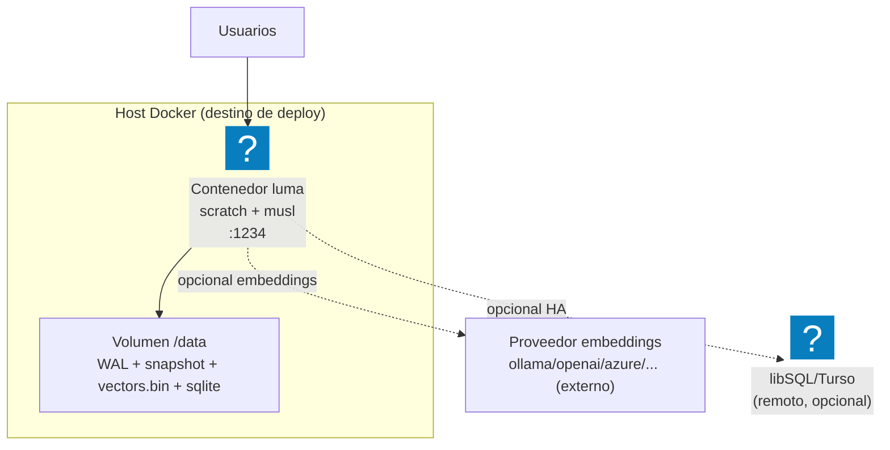

# Infraestructura

_tipo: infrastructure_ · _origen: 28e031171e77_

NO hay infraestructura AWS: no existe terraform (*.tf/tfstate/tfvars), ni task definitions ECS/Fargate, ni SAM/Serverless (template.yaml), ni sección <!-- tooling:deploy --> en CLAUDE.md. El AWS CLI no tiene credenciales configuradas (aws sts get-caller-identity → 'Unable to locate credentials'), por lo que no se consultó nada en la nube. El único artefacto de despliegue es un contenedor Docker (Dockerfile multi-stage: builder clux/muslrust → runtime FROM scratch, binario estático 'luma serve' en puerto 1234) orquestado con docker-compose.yml sobre un host único, con volumen local ./data_storage:/data, límite de 512M y healthcheck a /v1/health. Los múltiples matches de 'aws/lambda/azure' en el código son opciones de proveedores de embeddings/almacenamiento (no infra AWS provisionada). Proyecto aún no desplegado en AWS; el diagrama refleja el despliegue Docker planificado/real. Si en el futuro se migra a AWS, el patrón natural sería ECR (imagen) → ECS/Fargate o EC2 (t3.small) → EBS/EFS para /data, con ALB + ACM al frente.

<!-- tooling:diagram
{"is_aws": false, "target": "none", "region": null, "components": [{"kind": "docker", "name": "luma", "detail": "Contenedor scratch + musl (x86_64-unknown-linux-musl), binario estático /luma, EXPOSE 1234, límite 512M, restart unless-stopped, healthcheck /v1/health"}, {"kind": "volume", "name": "/data", "detail": "Bind mount ./data_storage:/data — WAL (events-*.log), snapshot.json, vectors/*/vectors.bin (mmap), sqlite/rustkiss.db"}, {"kind": "external", "name": "embeddings", "detail": "Opcional: proveedor externo (ollama/openai/azure/cohere/hf) vía EMBEDDING_URL/API_KEY"}, {"kind": "external", "name": "libsql-turso", "detail": "Opcional HA: LIBSQL_URL (Hrana sobre HTTPS) reemplaza SQLite local"}], "mermaid": "flowchart TB\n  U[\"Usuarios\"] --> D@{ shape: icon, icon: \"logos:docker-icon\", label: \"Contenedor luma scratch + musl :1234\" }\n  subgraph HOST[\"Host Docker (destino de deploy)\"]\n    D --> V[\"Volumen /data WAL + snapshot + vectors.bin + sqlite\"]\n  end\n  D -.->|opcional embeddings| EMB[\"Proveedor embeddings ollama/openai/azure/... (externo)\"]\n  D -.->|opcional HA| LSQL@{ shape: icon, icon: \"logos:sqlite\", label: \"libSQL/Turso (remoto, opcional)\" }", "notes": "NO hay infraestructura AWS: no existe terraform (*.tf/tfstate/tfvars), ni task definitions ECS/Fargate, ni SAM/Serverless (template.yaml), ni sección <!-- tooling:deploy --> en CLAUDE.md. El AWS CLI no tiene credenciales configuradas (aws sts get-caller-identity → 'Unable to locate credentials'), por lo que no se consultó nada en la nube. El único artefacto de despliegue es un contenedor Docker (Dockerfile multi-stage: builder clux/muslrust → runtime FROM scratch, binario estático 'luma serve' en puerto 1234) orquestado con docker-compose.yml sobre un host único, con volumen local ./data_storage:/data, límite de 512M y healthcheck a /v1/health. Los múltiples matches de 'aws/lambda/azure' en el código son opciones de proveedores de embeddings/almacenamiento (no infra AWS provisionada). Proyecto aún no desplegado en AWS; el diagrama refleja el despliegue Docker planificado/real. Si en el futuro se migra a AWS, el patrón natural sería ECR (imagen) → ECS/Fargate o EC2 (t3.small) → EBS/EFS para /data, con ALB + ACM al frente.", "source_sha": "28e031171e777c190648013bf87ef478f67f8c1b", "kind": "infrastructure"}
-->
