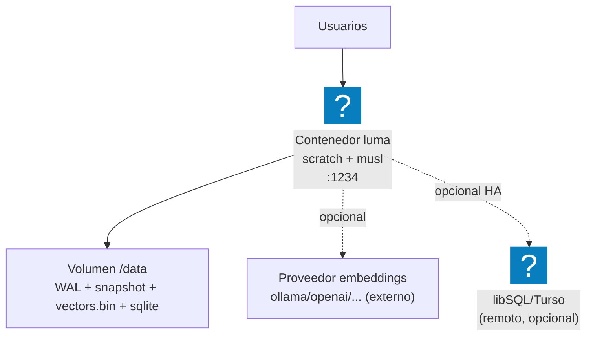

# Infraestructura

_tipo: infrastructure_ · _origen: 4adf8741b8c0_

NO hay infraestructura AWS definida ni desplegada: sin Terraform (*.tf/tfstate/tfvars), sin carpetas infra/terraform/deploy, sin task-definitions ECS/Fargate ni SAM/Serverless, sin sección <!-- tooling:deploy --> en CLAUDE.md, y el AWS CLI no tiene credenciales (NoCredentials). El proyecto se distribuye como binario Rust + imagen Docker (Dockerfile -> FROM scratch, binario musl estático, EXPOSE 1234, ENTRYPOINT /luma serve) orquestada con docker-compose.yml (servicio 'luma', volumen local ./data_storage, healthcheck a /v1/health, restart unless-stopped). La única mención a AWS es 'AWS Graviton 2/3' en release.yml como target de compilación ARM64 del binario, NO como destino de despliegue. Deps externas OPCIONALES por env: proveedor de embeddings (ollama/openai/azure/cohere/hf) y libSQL/Turso para HA de SQL. Mapeo AWS natural si se desplegara (deducido por convención, no presente en el repo): la imagen encajaría en ECS/Fargate o EC2, el volumen /data en EBS/EFS, e ingress por ALB — aún no desplegado en AWS.

<!-- tooling:diagram
{"is_aws": false, "target": "none", "region": null, "components": [{"kind": "docker", "name": "luma", "detail": "Contenedor scratch, binario musl estático, puerto 1234, límite 512M RAM, healthcheck /v1/health"}, {"kind": "volume", "name": "data_storage", "detail": "Volumen local montado en /data (WAL, snapshot, vectors.bin, sqlite/rustkiss.db)"}], "mermaid": "flowchart TB\n  U[\"Usuarios\"] --> D@{ shape: icon, icon: \"logos:docker-icon\", label: \"Contenedor luma scratch + musl :1234\" }\n  D --> V[\"Volumen /data WAL + snapshot + vectors.bin + sqlite\"]\n  D -.->|opcional| EMB[\"Proveedor embeddings ollama/openai/... (externo)\"]\n  D -.->|opcional HA| LSQL@{ shape: icon, icon: \"logos:sqlite\", label: \"libSQL/Turso (remoto, opcional)\" }", "notes": "NO hay infraestructura AWS definida ni desplegada: sin Terraform (*.tf/tfstate/tfvars), sin carpetas infra/terraform/deploy, sin task-definitions ECS/Fargate ni SAM/Serverless, sin sección <!-- tooling:deploy --> en CLAUDE.md, y el AWS CLI no tiene credenciales (NoCredentials). El proyecto se distribuye como binario Rust + imagen Docker (Dockerfile -> FROM scratch, binario musl estático, EXPOSE 1234, ENTRYPOINT /luma serve) orquestada con docker-compose.yml (servicio 'luma', volumen local ./data_storage, healthcheck a /v1/health, restart unless-stopped). La única mención a AWS es 'AWS Graviton 2/3' en release.yml como target de compilación ARM64 del binario, NO como destino de despliegue. Deps externas OPCIONALES por env: proveedor de embeddings (ollama/openai/azure/cohere/hf) y libSQL/Turso para HA de SQL. Mapeo AWS natural si se desplegara (deducido por convención, no presente en el repo): la imagen encajaría en ECS/Fargate o EC2, el volumen /data en EBS/EFS, e ingress por ALB — aún no desplegado en AWS.", "source_sha": "4adf8741b8c095e1309a1e6083240818b0763b4f", "kind": "infrastructure"}
-->
